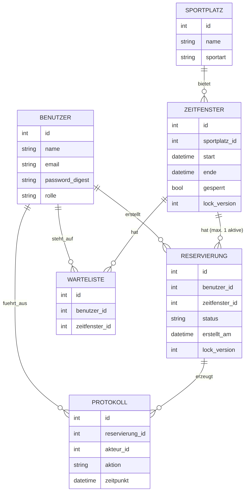
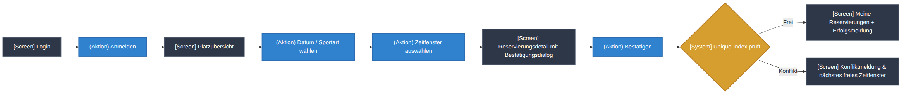
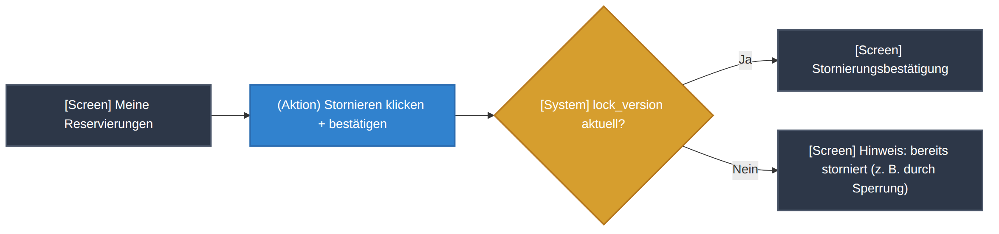
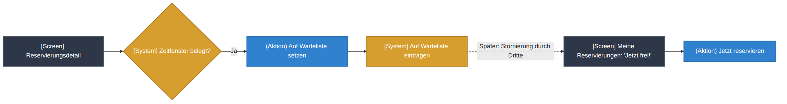
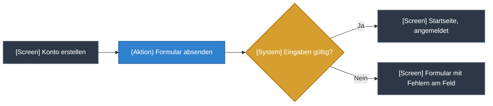
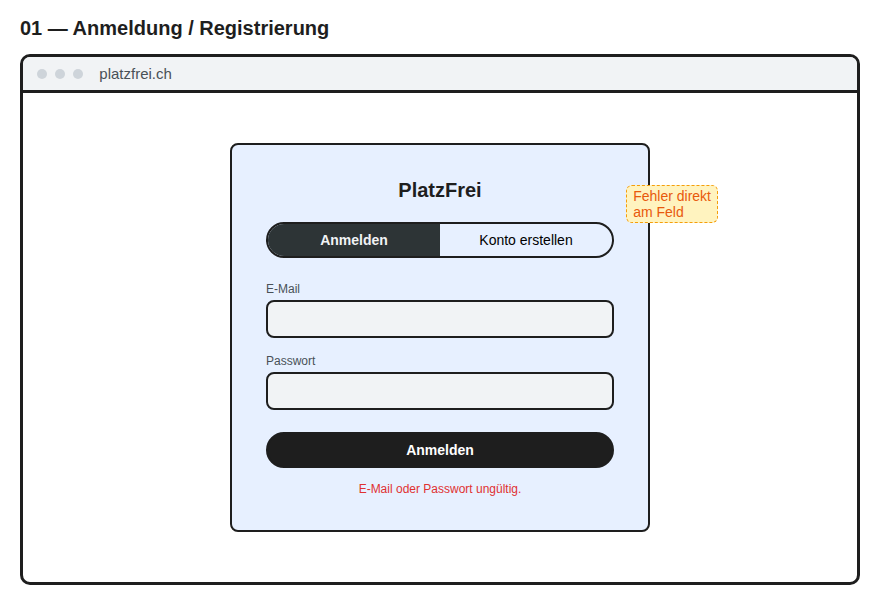
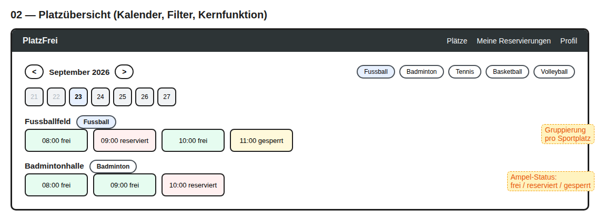
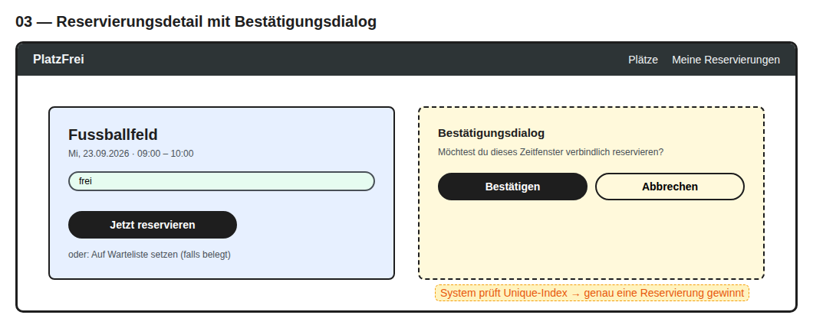
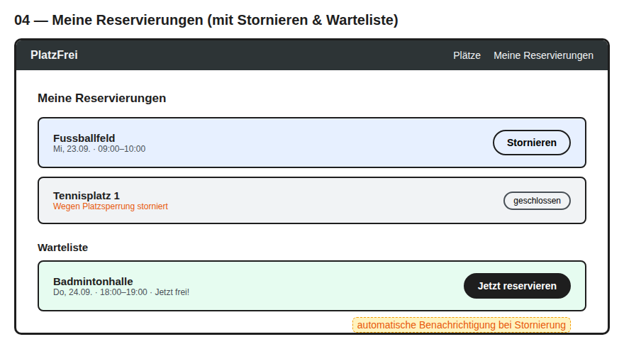
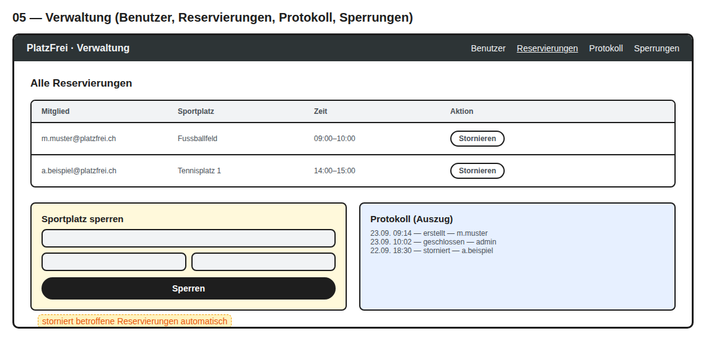

# Dokumentation PlatzFrei

| | |
|---|---|
| **Modul** | M233 – Multiuser-Applikation entwickeln |
| **Datum** | 24.09.2026 |
| **Name** | Leandro Fragale |
| **Klasse** | 24E |

---

## Inhalt

1. Problemstellung
2. Vision
3. Funktionale Anforderungen
4. Qualitätsattribute
5. Benutzerrollen und Berechtigungen
6. Locking und Transaktionen
7. ERM
8. Breadboards der User-Flows
9. Wireframes
10. Erreichter Stand
11. Begründung Abweichung
12. Prüfung der Anforderungen und Ergebnisse

---

## 1. Problemstellung

In vielen Sportvereinen und Schulanlagen mit begrenzten Feldern/Hallen (z. B. Tennis, Badminton, Fussball, Volleyball) werden Trainingszeiten aktuell manuell koordiniert – per WhatsApp-Gruppe oder mündlicher Absprache. Das führt regelmässig zu:

- **Doppelbelegungen**, wenn zwei Personen gleichzeitig denselben Platz für dieselbe Zeit reservieren
- **Konflikten**, wenn eine Reservierung kurzfristig (z. B. wegen Wartung oder Turnier) storniert werden muss

Dieses Problem betrifft alle Vereinsmitglieder wöchentlich und verschärft sich mit zunehmender Mitgliederzahl. Eine digitale Multiuser-Applikation kann Reservierungen zentral, verbindlich und konfliktfrei verwalten.

## 2. Vision

| | |
|---|---|
| **Domäne** | Vereinssport / Ressourcenverwaltung |
| **Applikation** | PlatzFrei |
| **Vision** | PlatzFrei ermöglicht es Vereinsmitgliedern, Sportplätze verbindlich und ohne Doppelbuchung zu reservieren, während Platzverantwortliche jederzeit den Überblick über Belegung, Sperrungen und Konflikte behalten. |

Wichtigste Anforderung der 1. MVP-Iteration ist die **konfliktfreie Reservierung eines Zeitfensters für einen Sportplatz**.

## 3. Funktionale Anforderungen

1. Verfügbare Sportplätze und Zeitfenster für ein gewähltes Datum einsehen (gefiltert nach Sportart/Platz)
2. Ein freies Zeitfenster für einen Sportplatz reservieren
3. Eigene Reservierung einsehen und stornieren
4. Platzverantwortliche/r kann einen Sportplatz für einen Zeitraum sperren (Wartung, Turnier) – bestehende Reservierungen in diesem Zeitraum werden automatisch storniert und die betroffenen Mitglieder benachrichtigt
5. Platzverantwortliche/r kann alle Reservierungen einsehen und im Konfliktfall (z. B. Missbrauch) stornieren
6. Mitglied kann sich registrieren und anmelden
7. Bei belegtem Zeitfenster kann sich ein Mitglied auf eine Warteliste setzen und wird bei Stornierung automatisch benachrichtigt

## 4. Qualitätsattribute

**Datenkonsistenz:** Reservieren zwei Mitglieder gleichzeitig dasselbe Zeitfenster desselben Sportplatzes, wird genau eine Reservierung bestätigt; die zweite Person erhält sofort eine Fehlermeldung mit Vorschlag des nächsten freien Zeitfensters.

1. **Aktualität der Verfügbarkeitsanzeige:** Ein erfolgreich reserviertes Zeitfenster verschwindet innerhalb von 5 Sekunden aus der Verfügbarkeitsansicht aller anderen angemeldeten Benutzer.
2. **Performance:** Die Verfügbarkeitsübersicht für einen Tag mit 15 Sportplätzen liefert bei 20 gleichzeitigen Anfragen die Ergebnisse innerhalb von 2 Sekunden.
3. **Nachvollziehbarkeit:** Jede Stornierung und jede Platzsperrung wird mit Zeitstempel und ausführender Person protokolliert und ist für Platzverantwortliche jederzeit einsehbar.
4. **Konsistenz bei Sperrungen:** Sperrt eine Platzverantwortliche/ein Platzverantwortlicher einen Sportplatz, während ein Mitglied gleichzeitig eine Reservierung dafür storniert oder erstellt, bleibt der Datenbestand konsistent (keine doppelte Freigabe, keine „Geister-Reservierung").

## 5. Benutzerrollen und Berechtigungen

| Rolle | Berechtigung |
|---|---|
| **Vereinsmitglied** | Sportplätze und Verfügbarkeit einsehen, Zeitfenster reservieren, eigene Reservierungen stornieren, sich auf die Warteliste setzen, eigenes Profil bearbeiten |
| **Platzverantwortlicher** | Alles wie Vereinsmitglied, zusätzlich: Sportplätze sperren und Sperrungen aufheben, alle Reservierungen einsehen und stornieren, Protokoll einsehen, Benutzer einsehen |

Umsetzung: Rolle als Enum `rolle` (`mitglied` / `verantwortlicher`) auf `Benutzer`. Der gesamte Verwaltungsbereich (`Admin::`-Namespace) ist über `Admin::BaseController` (`require_login`, `require_verantwortlicher`) nur für Platzverantwortliche zugänglich. Mitglieder können nur eigene Reservierungen stornieren (Abfrage über `current_benutzer.reservierungen`, fremde → 404).

## 6. Locking und Transaktionen

| Funktion | Konflikt | Mechanismus | Begründung |
|---|---|---|---|
| **Reservierung erstellen** | Zwei Mitglieder legen gleichzeitig eine Reservierung für dasselbe Zeitfenster an (INSERT) | Partieller Unique-Index auf `reservierungen (zeitfenster_id) WHERE status = 'reserviert'` → zweiter INSERT scheitert mit `RecordNotUnique` | Nur die Datenbank kann zwei gleichzeitige INSERTs zuverlässig gegeneinander absichern; eine vorherige Prüfung im Code hätte eine Race Condition. |
| **Reservierung stornieren vs. Sportplatz sperren** | Mitglied und Platzverantwortliche/r ändern gleichzeitig dieselbe Reservierung (UPDATE) | Optimistic Locking über `lock_version` auf `reservierungen` → späterer Schreibzugriff erhält `StaleObjectError` | Optimistic Locking blockiert niemanden; Konflikte sind selten. |
| **Reservierung + Protokoll** | Protokolleintrag ohne gültige Reservierung | Eine Transaktion | Scheitert die Reservierung, darf kein Protokolleintrag entstehen. |
| **Sperrung + Autostornierung + Protokoll** | Sportplatz gesperrt, aber alte Reservierung bleibt gültig | Eine Transaktion; pro Reservierung ein Savepoint (`requires_new`) | Ein zeitgleich vom Mitglied storniertes Zeitfenster wird übersprungen, statt die ganze Sperrung abzubrechen. |

**Alternative – pessimistisches Locking:** Für die Sperrung wäre ein pessimistischer Lock möglich. Er würde jedoch die gesamte Datenbank für die Dauer der Sperrung exklusiv sperren und den häufigeren Reservierungsablauf ausbremsen. Deshalb wurde er bewusst nicht eingesetzt.

## 7. ERM

## 8. Breadboards der User-Flows

**Flow 1 – Reservierung erstellen**

**Flow 2 – Reservierung stornieren**

**Flow 3 – Sportplatz sperren (Platzverantwortlicher)**

**Flow 4 – Warteliste**

**Flow 5 – Reservierung verwalten (Platzverantwortlicher)**

**Flow 6 – Registrierung**

## 9. Wireframes

**01 — Anmeldung / Registrierung**

**02 — Platzübersicht (Kalender, Filter, Kernfunktion)**

**03 — Reservierungsdetail mit Bestätigungsdialog**

**04 — Meine Reservierungen (mit Stornieren & Warteliste)**

**05 — Verwaltung (Benutzer, Reservierungen, Protokoll, Sperrungen)**

## 10. Erreichter Stand

### Funktionale Anforderungen

| Anforderung | Stand |
|---|---|
| Verfügbarkeit einsehen | Umgesetzt |
| Zeitfenster reservieren | Umgesetzt |
| Eigene Reservierung einsehen/stornieren | Umgesetzt |
| Sportplatz sperren | Umgesetzt |
| Alle Reservierungen verwalten | Umgesetzt |
| Registrierung und Anmeldung | Umgesetzt |
| Warteliste | Umgesetzt |

**Zusätzlich umgesetzt:** Benutzerprofil, Benutzerverwaltung, Protokollansicht, Aufheben von Sperrungen.

### Qualitätsattribute

| Qualitätsattribut | Stand | Umsetzung |
|---|---|---|
| Datenkonsistenz | erfüllt | Partieller Unique-Index; Konfliktmeldung mit nächstem freiem Zeitfenster |
| Aktualität | erfüllt | Server liefert bei jedem Seitenaufruf immer den aktuellen Datenbankstand aus |
| Performance | erfüllt | Übersicht lädt ohne N+1-Abfragen |
| Nachvollziehbarkeit | erfüllt | Protokoll erfasst Erstellung, Stornierung sowie Schliessung/Aufhebung durch Sperrung mit Zeitpunkt und Akteur – auch für Sperrungen ohne betroffene Reservierung |
| Konsistenz bei Sperrungen | erfüllt | `lock_version` auf `reservierungen`, Savepoint pro Reservierung in `Sportplatz#sperren!` |

## 11. Begründung Abweichung

| Antrag | Umsetzung | Begründung |
|---|---|---|
| Optimistisches Locking verhindert Doppelbuchungen bei der Erstellung | Doppelbuchung wird durch den partiellen Unique-Index verhindert; `lock_version` schützt nur den Fall Stornierung vs. Sperrung | Nach Feedback der Kursleitung korrigiert: `lock_version` greift nur bei UPDATEs bestehender Zeilen und kann zwei gleichzeitige INSERTs nicht verhindern. |
| `lock_version` nur auf Zeitfenster (ERM) | Zusätzlich `lock_version` auf Reservierung | Der echte UPDATE-Konflikt (Stornierung vs. Sperrung) betrifft die Reservierung, nicht das Zeitfenster. |
| Zeitfenster 1–0/1 Reservierung | 1–n, davon höchstens eine aktive | Stornierte Reservierungen bleiben für das Protokoll erhalten; die „0/1"-Regel gilt für aktive Reservierungen und wird durch den Unique-Index durchgesetzt. |
| Stornieren „löscht" die Reservierung (Flow 2) | Status wird auf storniert gesetzt | Protokolleinträge verweisen auf die Reservierung; Löschen würde die Nachvollziehbarkeit (QA4) zerstören. |
| Benachrichtigung bei Sperrung und Warteliste | Hinweis in der Applikation („Meine Reservierungen"), keine E-Mail | Keine zusätzliche Infrastruktur (Mail-Versand) für die 1. Iteration. |
| Pessimistisches Locking für die Sperrung (als Alternative) | Nicht umgesetzt | SQLite kann nur die ganze Datenbank sperren; das würde den häufigeren Reservierungsablauf blockieren. |

## 12. Prüfung der Anforderungen und Ergebnisse

Automatisierte Tests: `bin/rails test` → **101 Tests, 288 Assertions, 0 Failures, 0 Errors, 0 Skips** (Stand 24.09.2026).

Konventionen: `bin/rubocop` → 69 Dateien geprüft, keine Beanstandungen.

Wie die obenstehende Tabelle zeigt, sind alle funktionalen Anforderungen sowie die Rollentrennung und alle fünf Qualitätsattribute automatisiert getestet und bestanden; ergänzend abgesichert durch RuboCop und den manuellen Testdurchlauf mit zwei Browsern für die Multiuser-Fälle.
