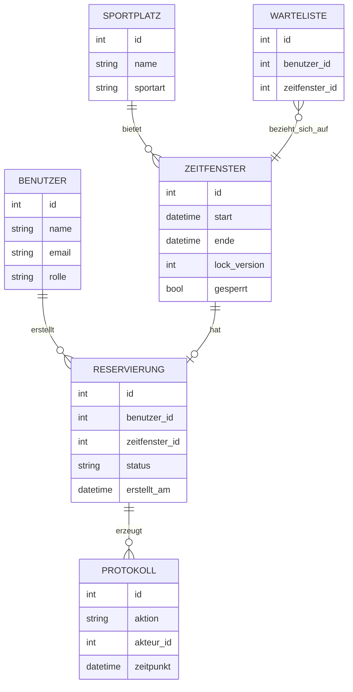
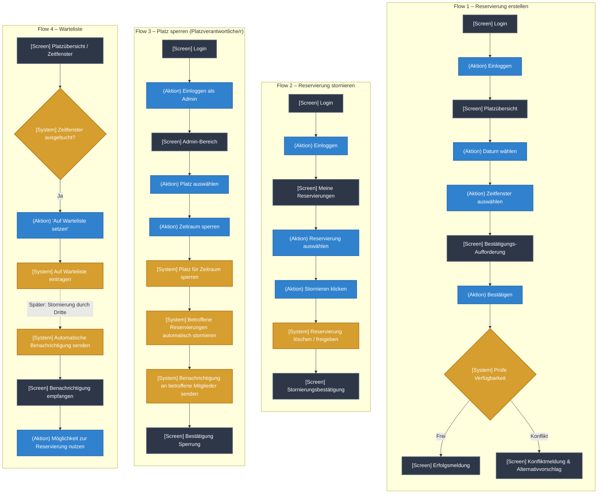

# Projektantrag: Sportplatz-Reservierung

**Modul:** M233 – Multiuser-Applikation entwickeln
**Datum:** 18.09.2026
**Autor:** Leandro Fragale
**Klasse:** 24E

---

## 1. Problemstellung

In vielen Sportvereinen und Schulanlagen mit begrenzten Feldern/Hallen (z. B. Tennis, Badminton, Fussball, Volleyball) werden Trainingszeiten aktuell manuell koordiniert – per WhatsApp-Gruppe oder mündlicher Absprache. Das führt regelmässig zu:

- **Doppelbelegungen**, wenn zwei Personen gleichzeitig denselben Platz für dieselbe Zeit reservieren
- **Konflikten**, wenn eine Reservierung kurzfristig (z. B. wegen Wartung oder Turnier) storniert werden muss

Dieses Problem betrifft alle Vereinsmitglieder wöchentlich und wird mit zunehmender Mitgliederzahl immer wie schlimmer. Eine digitale Multiuser-Applikation kann Reservierungen zentral, verbindlich und konfliktfrei verwalten.

---

## 2. Projekt

| | |
|---|---|
| **Domäne** | Vereinssport / Ressourcenverwaltung |
| **Name der Applikation** | **PlatzFrei** |
| **Vision** | PlatzFrei ermöglicht es Vereinsmitgliedern, Sportplätze verbindlich und ohne Doppelbuchung zu reservieren, während Platzverantwortliche jederzeit den Überblick über Belegung, Sperrungen und Konflikte behalten. |

### Projektplanung: 1. MVP-Iteration

Die wichtigste funktionale Anforderung der ersten Iteration ist die **konfliktfreie Reservierung eines Zeitfensters für einen Sportplatz**. Dafür müssen folgende Multi-User-Aspekte bereits in der 1. Iteration umgesetzt sein:

- Gleichzeitiger Zugriff mehrerer Mitglieder auf dieselbe Verfügbarkeitsübersicht
- Serverseitige Konfliktprüfung mit Locking, damit bei zeitgleichen Reservierungsversuchen für denselben Slot **genau eine** Reservierung bestätigt wird
- Rollenbasierte Berechtigung (Mitglied vs. Platzverantwortlicher)

---

## 3. Anforderungsanalyse

### 3.1 Funktionale Anforderungen (priorisiert)

1. Verfügbare Sportplätze und Zeitfenster für ein gewähltes Datum einsehen (gefiltert nach Sportart/Platz)
2. Ein freies Zeitfenster für einen Platz reservieren
3. Eigene Reservierung einsehen und stornieren
4. Platzverantwortlicher kann einen Platz für einen Zeitraum sperren (Wartung, Turnier) — bestehende Reservierungen in diesem Zeitraum werden automatisch storniert und die betroffenen Mitglieder benachrichtigt
5. Platzverantwortlicher kann alle Reservierungen eines Platzes einsehen und im Konfliktfall (z. B. Missbrauch) stornieren
6. Mitglied kann sich registrieren und einloggen
7. Bei ausgebuchtem Zeitfenster kann sich ein Mitglied auf eine Warteliste setzen und wird bei Stornierung automatisch benachrichtigt

### 3.2 Qualitätsattribute (priorisiert, überprüfbar, domänenbezogen)

1. **Datenkonsistenz:** Reservieren zwei Mitglieder gleichzeitig dasselbe Zeitfenster desselben Platzes, wird genau eine Reservierung bestätigt; die zweite Person erhält sofort eine Fehlermeldung mit Vorschlag des nächsten freien Zeitfensters.
2. **Aktualität der Verfügbarkeitsanzeige:** Ein erfolgreich reserviertes Zeitfenster verschwindet innerhalb von 5 Sekunden aus der Verfügbarkeitsansicht aller anderen eingeloggten Nutzer, sodass keine Reservierungsversuche auf bereits belegte Slots erfolgen.
3. **Performance:** Die Verfügbarkeitsübersicht für einen Tag mit 15 Plätzen liefert bei 20 gleichzeitigen Anfragen die Ergebnisse innerhalb von 2 Sekunden.
4. **Nachvollziehbarkeit:** Jede Stornierung und jede Platzsperrung wird mit Zeitstempel und ausführender Person protokolliert und ist für Platzverantwortliche jederzeit einsehbar.
5. **Konsistenz bei Sperrungen:** Sperrt eine Platzverantwortung einen Platz, während ein Mitglied gleichzeitig eine Reservierung dafür storniert oder erstellt, bleibt der Datenbestand konsistent (keine doppelte Freigabe, keine "Geister-Reservierung").

### 3.3 Benutzerrollen

| Rolle | Berechtigungen |
|---|---|
| **Vereinsmitglied** | Plätze und Verfügbarkeit einsehen, Zeitfenster reservieren, eigene Reservierungen stornieren, sich auf Warteliste setzen |
| **Platzverantwortliche/r** | Alles wie Mitglied, zusätzlich: Plätze anlegen/sperren, alle Reservierungen einsehen und stornieren, Protokoll einsehen |

### 3.4 Locking und Transaktionen

- **Optimistisches Locking auf Zeitfenster/Reservierung:** Da mehrere Mitglieder gleichzeitig auf dieselbe Verfügbarkeit zugreifen, muss die Reservierungs-Erstellung eine Versionsprüfung (z. B. `lock_version`) durchführen, um Race Conditions bei zeitgleichen Buchungsversuchen zu verhindern.
- **Transaktion bei Reservierung:** Das Anlegen einer Reservierung und der zugehörige Protokolleintrag (Activity Log) müssen atomar in einer Transaktion erfolgen — schlägt die Konfliktprüfung fehl, wird kein Protokolleintrag erzeugt.
- **Transaktion bei Platzsperrung:** Das Sperren eines Platzes und das automatische Stornieren aller betroffenen Reservierungen (inkl. Protokolleinträge und Benachrichtigungen) müssen als eine Transaktion behandelt werden, damit kein inkonsistenter Zwischenzustand entsteht (z. B. Platz gesperrt, aber alte Reservierung bleibt gültig).
- **Pessimistisches Locking (Alternative/Vergleich):** Für die Platzsperrung durch Platzverantwortliche könnte alternativ ein pessimistischer Lock auf den betroffenen Zeitfenstern sinnvoll sein, da hier eine ganze Gruppe von Reservierungen gleichzeitig verändert wird und Konflikte teurer wären als eine kurze Wartezeit.

---

## 4. ERM (Entity-Relationship-Model)

---

## 5. Breadboards der User-Flows (1. Iteration)

---

## 6. Fat-Marker-Sketches / Wireframes der Screens (1. Iteration)

- Login / Registrierung
- Platzübersicht mit Kalenderansicht (Filter nach Sportart, Datum)
- Reservierungsdetail mit Bestätigungsdialog
- „Meine Reservierungen" (Liste mit Stornier-Option)
- Admin-Dashboard (Plätze verwalten, Sperrungen, Protokoll)

---

## 7. Technologie-Stack 

- **Backend/Framework:** Ruby on Rails (Transaktionen, optimistisches Locking via `lock_version`, Admin-Namespacing)
- **Datenbank:** SQLite3 (Entwicklung) — Anpassung gemäss Unterrichtsvorgaben

---

